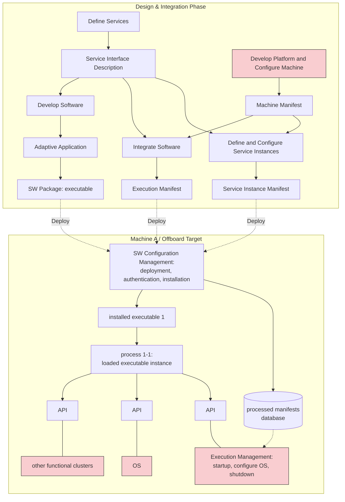

### I. Vehicle Function Architecture to Software Allocation

The top half of the diagram illustrates the top-down derivation of software architecture from vehicle functions, broken down into the following stages:

**1. Vehicle Function Architecture (OEM Level)**

* Defines abstract vehicle functions (A, B, C, D) and their internal function blocks (A.1, A.2, etc.).

**2. Preliminary Software Architecture**

* *Process:* Derive Abstract Platform Specification from Function Architecture.
* Maps the function blocks to **Abstract SWCs** (Software Components) 1 through 7.
* Provides a dedicated view of the software and communication relations between components and their service interfaces.

**3. Vehicle Software Architecture**

* *Process:* Derive Vehicle Software Architecture from Abstract Platform Specification.
* Categorizes the abstract SWCs into specific platform targets:
* **Adaptive SWCs (1, 5, 6):** Utilize service-oriented communication.
* **Classic SWCs (2, 3, 4):** Utilize signal-based communication. Requires signal/service translation when interacting with Adaptive SWCs.
* **Non-AUTOSAR SWC (7):** Handles external communication.

**4. Sub-system Extraction and View Allocation**

* *Process:* Allocation of AAs (Adaptive Applications) and SWCs into CP (Classic Platform) ECU-Instances or AP (Adaptive Platform) Machines. Design communication (SOA interfaces, Signal to Service, etc.).
* **AP View:** Contains Adaptive SWC 1 and 5.
* **AP/CP Mixed View:** Contains Adaptive SWC 6 and Classic SWC 2.
* **CP VFB View:** Contains Classic SWC 3 and 4. (This feeds directly into the standard *Classic AUTOSAR development methodology*).
* *Result:* Preliminary function components, their interfaces, and topologies to be distributed to Tier 1 suppliers.

---

### II. Adaptive AUTOSAR Development Methodology

The bottom half maps the High-Level Architecture Design responsibilities to the actual implementation and deployment workflow.

#### Responsibility Legend

* **Blue:** OEM
* **Green:** Tier 1s
* **Red/Pink:** Other suppliers (platform, machine vendors)

#### Architecture Design Stages (Left Panel)

1. **Application Design:** Adaptive Application (app, executable, process) and Service Interfaces (port, interface, datatype, interface mapping).
2. **Machine Design:** Platform FCs (Functional Clusters) configuration, Machine configuration, Integration of software (mapping process, adaptive application, and platform/service binding).
3. **OS and Machine Deployment:** Build and deploy output software packages.
4. **Platform Functional Cluster & OS:** Developed/provided by 3rd party vendor and configured/integrated by Tier 1 during stages 2 and 3.

#### Process Flowchart

