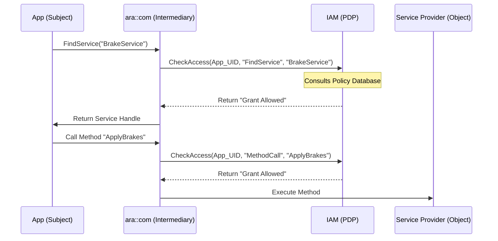

The **Identity and Access Management (IAM)** cluster is the "Security Gatekeeper" of the Adaptive Platform. While **Execution Management** handles starting a process, **IAM** decides what that process is actually allowed to do once it’s running.

It provides a framework for **Attribute-Based Access Control (ABAC)**, ensuring that a compromised application cannot arbitrarily call sensitive services (like "Unlock Doors" or "Flash Firmware").

---

### 1. The Core Concept: The "Policy Decision"

IAM works on a Request/Response pattern. When a "Subject" (an App) tries to perform an "Action" on an "Object" (a Service), the platform intercepts the call and asks IAM for a decision.

* **Access Control Decision (ACD):** A simple `Yes/No` based on the application's identity.
* **Identity:** In Adaptive, an identity is typically tied to the **Process ID (PID)** and the **Security ID (UID/GID)** assigned by Execution Management during startup.

---

### 2. Implementation Options (The "How")

The specification allows for different architectural implementations depending on the safety and security requirements of the Machine.

#### Option A: Centralized IAM Daemon (Reference Model)

A standalone "IAM Manager" process holds all the policies.

* **Mechanism:** When `ara::com` receives a service request, it sends a message to the IAM Daemon.
* **Pros:** Easy to update policies in one place.
* **Cons:** High performance overhead (latency) due to Inter-Process Communication (IPC) for every check.

#### Option B: Library-Based (Local Enforcement)

The access control logic is linked directly into the functional cluster libraries (like `ara::com`).

* **Mechanism:** The library reads a local, "compiled" version of the security policy.
* **Pros:** Extremely fast (no IPC).
* **Cons:** Difficult to update policies without restarting the processes; harder to ensure the app hasn't "tampered" with its own library.

#### Option C: OS-Kernel Integration (Hardened)

Uses standard Linux/POSIX security modules (LSM) like **SELinux** or **AppArmor**.

* **Mechanism:** IAM translates AUTOSAR manifests into SELinux policies.
* **Pros:** Highest security; even if the app's memory is compromised, the kernel prevents the action.

---

### 3. Practical "Schema": The Grant

Access rights are defined in the **Manifest** as **Grants**. A Grant is the link between an application and a capability.

| Component | Example |
| --- | --- |
| **Subject** | `Diagnostic_App` |
| **Operation** | `ara::com::FindService` |
| **Object** | `BatteryManagementService` |
| **Constraint** | `Only when VehicleSpeed == 0` |

---

### 4. IAM in the Communication Flow

This is where IAM is most active—preventing unauthorized Service-Oriented Communication.

---

### 5. Interaction with Other Clusters

* **Execution Management (EM):** EM provides the "Identity" (UID/GID) to IAM. IAM ensures the binary being run matches the one authorized in the manifest.
* **Update & Config Management (UCM):** When a new app is installed, UCM provides the new security "Grants" to IAM.
* **Crypto Stack:** IAM uses the Crypto cluster to verify digital signatures on the security policies to ensure they weren't tampered with during the OTA update.

---

### 6. C++ Usage (`ara::iam`)

Unlike `ara::com`, most applications **do not call IAM directly**. IAM is a "transparent" layer.

* Developers define the security requirements in the **ARXML manifest**.
* The platform (middleware) automatically performs the checks.
* If an app lacks permission, an `ara::core::Result` with the error `kPermissionDenied` is returned to the app.

---

### 7. Summary of implementation hurdles

* **Granularity:** Setting policies too broad is insecure; setting them too narrow makes the manifest massive and unreadable.
* **Performance:** In real-time ADAS systems, the time it takes for IAM to say "Yes" must be sub-millisecond. This usually forces **Option B** or **C** from above.
The **Identity and Access Management (IAM)** cluster is the "Security Gatekeeper" of the Adaptive Platform. While **Execution Management** handles starting a process, **IAM** decides what that process is actually allowed to do once it’s running.

It provides a framework for **Attribute-Based Access Control (ABAC)**, ensuring that a compromised application cannot arbitrarily call sensitive services (like "Unlock Doors" or "Flash Firmware").

---

### 1. The Core Concept: The "Policy Decision"

IAM works on a Request/Response pattern. When a "Subject" (an App) tries to perform an "Action" on an "Object" (a Service), the platform intercepts the call and asks IAM for a decision.

* **Access Control Decision (ACD):** A simple `Yes/No` based on the application's identity.
* **Identity:** In Adaptive, an identity is typically tied to the **Process ID (PID)** and the **Security ID (UID/GID)** assigned by Execution Management during startup.

---

### 2. Implementation Options (The "How")

The specification allows for different architectural implementations depending on the safety and security requirements of the Machine.

#### Option A: Centralized IAM Daemon (Reference Model)

A standalone "IAM Manager" process holds all the policies.

* **Mechanism:** When `ara::com` receives a service request, it sends a message to the IAM Daemon.
* **Pros:** Easy to update policies in one place.
* **Cons:** High performance overhead (latency) due to Inter-Process Communication (IPC) for every check.

#### Option B: Library-Based (Local Enforcement)

The access control logic is linked directly into the functional cluster libraries (like `ara::com`).

* **Mechanism:** The library reads a local, "compiled" version of the security policy.
* **Pros:** Extremely fast (no IPC).
* **Cons:** Difficult to update policies without restarting the processes; harder to ensure the app hasn't "tampered" with its own library.

#### Option C: OS-Kernel Integration (Hardened)

Uses standard Linux/POSIX security modules (LSM) like **SELinux** or **AppArmor**.

* **Mechanism:** IAM translates AUTOSAR manifests into SELinux policies.
* **Pros:** Highest security; even if the app's memory is compromised, the kernel prevents the action.

---

### 3. Practical "Schema": The Grant

Access rights are defined in the **Manifest** as **Grants**. A Grant is the link between an application and a capability.

| Component | Example |
| --- | --- |
| **Subject** | `Diagnostic_App` |
| **Operation** | `ara::com::FindService` |
| **Object** | `BatteryManagementService` |
| **Constraint** | `Only when VehicleSpeed == 0` |

---

### 4. IAM in the Communication Flow

This is where IAM is most active—preventing unauthorized Service-Oriented Communication.

---

### 5. Interaction with Other Clusters

* **Execution Management (EM):** EM provides the "Identity" (UID/GID) to IAM. IAM ensures the binary being run matches the one authorized in the manifest.
* **Update & Config Management (UCM):** When a new app is installed, UCM provides the new security "Grants" to IAM.
* **Crypto Stack:** IAM uses the Crypto cluster to verify digital signatures on the security policies to ensure they weren't tampered with during the OTA update.

---

### 6. C++ Usage (`ara::iam`)

Unlike `ara::com`, most applications **do not call IAM directly**. IAM is a "transparent" layer.

* Developers define the security requirements in the **ARXML manifest**.
* The platform (middleware) automatically performs the checks.
* If an app lacks permission, an `ara::core::Result` with the error `kPermissionDenied` is returned to the app.

---
