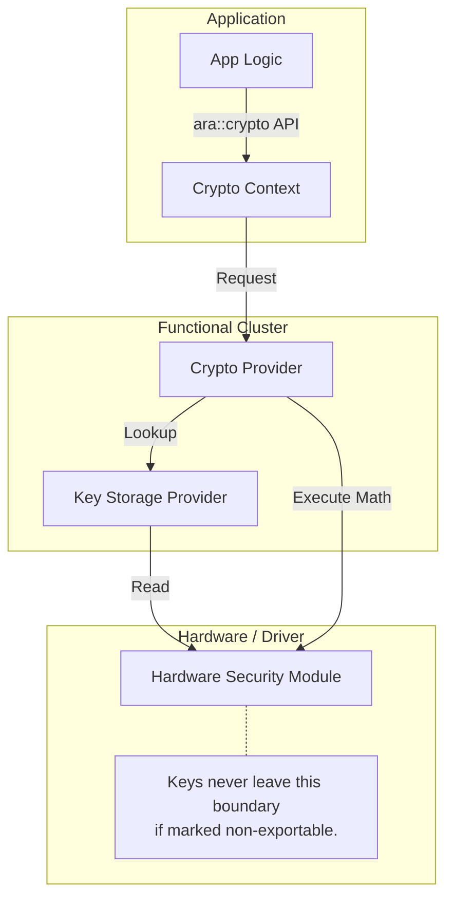

The **AUTOSAR Crypto Stack (`ara::crypto`)** is the platform's security foundation. It abstracts complex cryptographic operations behind a standardized C++ API, ensuring that applications don't need to know whether the math is happening in software or on a dedicated **Hardware Security Module (HSM)**.

---

### 1. Architectural Role

The Crypto cluster acts as a middleware between the high-level application and the **Crypto Driver** (the hardware implementation). Its primary goal is to manage the lifecycle of cryptographic materials (keys, certificates) and provide high-performance encryption/decryption services.

---

### 2. Functional Pillars

The specification divides the crypto world into four main "Provider" types:

* **Key Storage Provider (KSP):** Manages the physical storage of keys. It ensures that a key marked "Non-Exportable" never leaves the secure memory of the HSM.
* **Cryptography Provider (CP):** Performs the actual math (Encryption, Hashing, Signatures).
* **X.509 Provider:** Handles identity certificates (parsing, verifying chains, and checking expiration).
* **Key Management (KM):** Handles high-level logic like key generation, derivation (creating a new key from a master key), and key exchange (Diffie-Hellman).

---

### 3. The "Key Slot" Concept (Schema)

Applications in Adaptive AUTOSAR rarely handle raw binary keys. Instead, they interact with **Key Slots** defined in the Manifest. This is a critical security feature.

| Element | Description |
| --- | --- |
| **Slot ID** | A unique reference to a storage location in the HSM/Secure Flash. |
| **Algorithm Family** | Restricts the slot to a specific type (e.g., `AES-128`, `RSA-2048`). |
| **Allowed Usage** | Flags that restrict the key: `Encrypt`, `Decrypt`, `Sign`, or `Verify`. |
| **Exportability** | If `False`, the key can never be read as raw bytes, only used via the API. |

---

### 4. C++ Implementation Patterns

The `ara::crypto` API uses a "Context-based" approach. You first create a context for an algorithm, then perform the operation.

#### A. Hashing Example

```cpp
// Create a hasher context
auto hasher = cryptoProvider->CreateHashFunctionCtx(SHA2_256_ALG_ID);
hasher->Start();
hasher->Update(myPayload);
auto result = hasher->Finish();

```

#### B. Safe Asset Management

Every crypto object is wrapped in a **`ara::crypto::TrustedContainer`**. This container acts as the bridge between the persistent storage and the active memory, ensuring integrity checks are performed before the key is used.

---

### 5. Interaction & Dependencies

| Interface Partner | Purpose |
| --- | --- |
| **UCM (Update)** | Verifies the digital signature of software clusters before installation. |
| **IAM (Identity)** | Authenticates the identity of apps based on signed certificates. |
| **Persistency** | Uses the Crypto stack to provide "Encrypted Key-Value Storage." |
| **Communication** | Provides the primitives for **TLS (Transport Layer Security)** and **SecOC** (Secure On-board Communication). |

---

### 6. Crypto Service Flow (Mermaid)



---

### 7. Key Error Codes (`CryptoErrorDomain`)

* **`kUnknownIdentifier`**: The app tried to use a Key Slot ID not assigned to it in the manifest.
* **`kIncompatibleArguments`**: Trying to use an RSA key with an AES encryption context.
* **`kAuthTagVerificationFailed`**: In Authenticated Encryption (AEAD), the data was modified or the key is wrong.
* **`kUsageViolation`**: Attempting to `Decrypt` with a key that is marked as `Sign-Only`.
