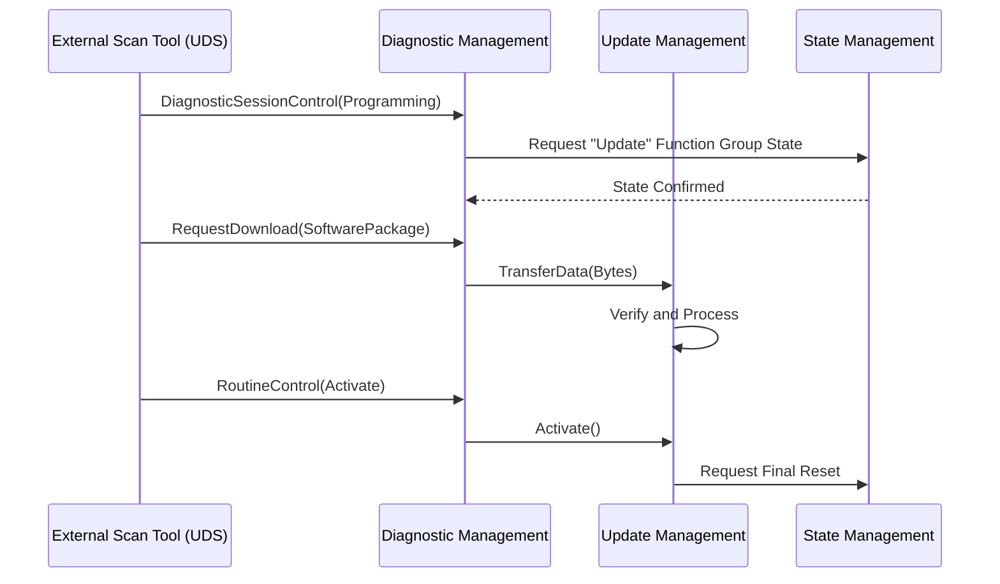

The **Diagnostic Management (DM)** functional cluster, residing in the **`ara::dm`** namespace, is the Adaptive Platform's center for vehicle-health monitoring and off-board communication. It implements the ISO 14229 (UDS) and ISO 13400 (DoIP) standards.

### 1. Architectural Role

DM acts as the gateway between the vehicle's internal software state and external tools (like a mechanic's scan tool or an OTA server). It monitors local software for failures and exposes those failures through standardized diagnostic protocols.

---

### 2. Primary Functions & Error Reporting

DM manages two distinct types of "health" data:

#### A. Diagnostic Trouble Codes (DTCs)

When a functional cluster or application detects a failure, it reports an **Event** to DM.

* **Event Reporting:** Applications use `DiagnosticEvent` to report status (`Passed`, `Failed`, `Prefailed`).
* **DTC Management:** DM aggregates these events. If an event persists (based on "debounce" logic), DM stores a DTC in non-volatile memory.
* **Snapshots & Extended Data:** DM captures "freeze frames" (e.g., vehicle speed, timestamp, or temperature) at the exact moment a failure occurs to help with later debugging.

#### B. Diagnostic Services (UDS)

DM handles the server-side implementation of Unified Diagnostic Services (UDS).

* **Read/Write Data (0x22 / 0x2E):** Allows external tools to read internal variables or configure parameters.
* **Routine Control (0x31):** Triggers specific procedures, such as a self-test or a calibration routine.

---

### 3. Role in UCM (Update & Config Management)

DM is the primary "trigger" and "gatekeeper" for UCM in many traditional shop-tool scenarios.

* **Diagnostic Session Control (0x10):** Before UCM can update the system, the diagnostic tool often moves the Machine into a "Programming Session."
* **TransferData (0x36) & RequestDownload (0x34):** In many implementations, the actual software bytes are moved via UDS services. DM receives these bytes and hands them over to **UCM** for processing.
* **Condition Checks:** DM verifies "Safety Conditions" before an update starts (e.g., ensuring the engine is off and the vehicle is in "Park"). If conditions aren't met, it rejects the UCM activation request.

---

### 4. External Interfaces & C++ Usage

DM uses a service-oriented approach to communicate with applications.

| Component | Usage |
| --- | --- |
| **`ara::dm::DiagnosticEvent`** | Used by apps to report errors. |
| **`ara::dm::GenericDiagnosticService`** | Allows an application to handle custom UDS requests not natively supported by the platform. |
| **`ara::dm::DataIdentifier` (DID)** | Maps specific C++ variables to UDS Data IDs for external reading. |

**Error Handling Note:**
Consistent with `ara::core`, all diagnostic requests return an `ara::core::Result`. If a diagnostic service fails (e.g., a "Security Access Denied"), DM returns a **Negative Response Code (NRC)** mapped into an `ara::core::ErrorCode`.

---

### 5. Interaction Flow: Diagnostic-Led Update

---

### 6. Summary Table: DM vs. UCM vs. SM

| Cluster | Role in Error/Update |
| --- | --- |
| **DM** | **Reports** the error (DTC) and **Transports** the update data from the tool. |
| **UCM** | **Installs** the software and verifies the package signature. |
| **SM** | **Decides** if it is safe to enter the update state based on vehicle conditions. |
