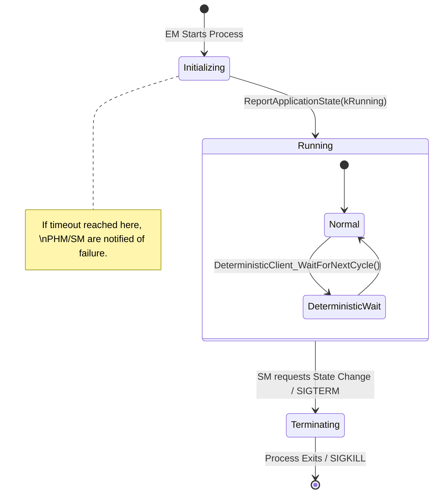
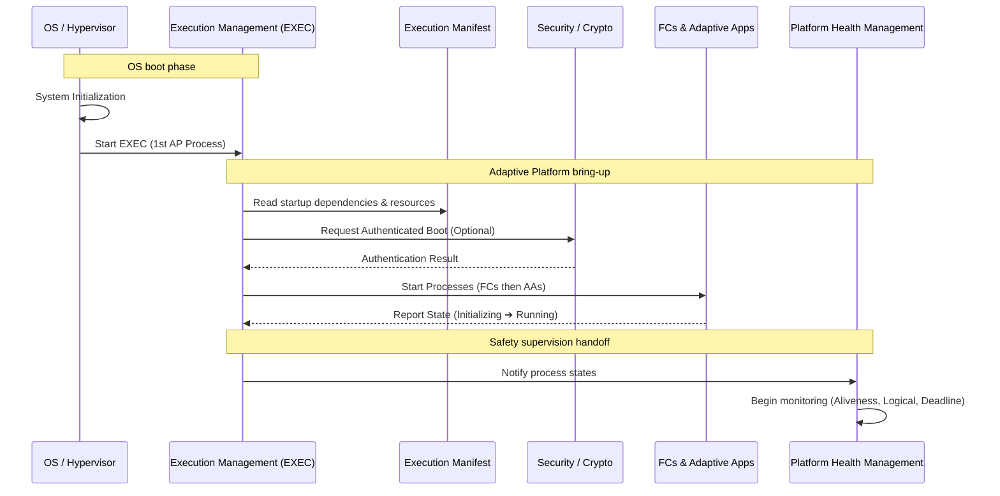

The **Execution Management (EM)** functional cluster is the first process to run after the OS kernel boots. Its primary role is to manage the system's initialization and the entire lifecycle of all other applications.

If **State Management (SM)** is the "Commander," **Execution Management** is the "Foreman" that does the actual work of starting and stopping processes.

---

### 1. Architectural Role

EM is responsible for **Deterministic Execution**, **Resource Management**, and **Process Lifecycle**. It ensures that processes are started in the correct order (dependency management) and that they stay within their allocated CPU and memory "sandboxes."

---

### 2. Primary Functions

#### A. System Start-up and Shutdown

EM uses a "Manifest" (the **Execution Manifest**) to determine which processes to start and in what order.

* **Startup:** It transitions the machine through "Machine States" (e.g., `Startup`, `Running`, `Shutdown`).
* **Shutdown:** It handles graceful termination by sending `SIGTERM` to processes, allowing them to save data via `ara::per` before force-killing them.

#### B. Process Lifecycle Management

EM manages the state of each individual process:

* **Idle:** The process is loaded but not executing.
* **Starting:** EM has issued the `fork`/`exec` calls.
* **Running:** The process has called `ReportApplicationState(kRunning)`.
* **Terminating:** EM has requested the process to stop.

#### C. Determinism and Resource Limiting

To ensure automotive-grade reliability, EM interfaces with the OS (typically a POSIX-compliant RTOS) to enforce:

* **CPU Affinity:** Binding processes to specific cores.
* **Scheduling Policies:** Setting FIFO or Round Robin priorities.
* **Resource Groups:** Assigning memory limits and CPU quotas to prevent a "rogue" app from starving the rest of the system.

---

### 3. State Reporting (C++ Interface)

Unlike other clusters where apps call APIs to "get" something, the relationship with EM is often about "reporting." The primary API is **`ara::exec`**.

* **`DeterministicClient`:** A specialized API for applications that must run in a "Lock-Step" or strictly timed cycle. It provides "Wait Points" to synchronize with the system clock.
* **`ExecutionClient::ReportApplicationState`:** Every Adaptive Application **must** call this to tell EM it has finished its internal initialization. If an app fails to report this within a timeout defined in the manifest, EM may treat it as a startup failure.

---

### 4. Deterministic Execution Model

For safety-critical functions (like ADAS), EM supports a **Deterministic Execution** mode. This ensures that:

1. **Input Determinism:** The process receives the same inputs in the same cycle.
2. **Time Determinism:** The process completes within a fixed window.
3. **Internal State Determinism:** The process produces the same output given the same input and internal state.

---

### 5. Process Lifecycle (Mermaid)

## 6. Startup Sequence & Execution Management

The OS boots the system and hands control to Execution Management (EXEC), which acts as the entry point for the Adaptive Platform. EXEC brings up the rest of the system based on rules defined in the Execution Manifest.

### 7. External Interfaces & Dependencies

| Interface Partner | Direction | Purpose |
| --- | --- | --- |
| **State Management** | SM $\rightarrow$ EM | The "Trigger." SM tells EM *which* Function Group state to transition to. |
| **Platform Health** | EM $\rightarrow$ PHM | EM notifies PHM if a process fails to start or crashes unexpectedly. |
| **Manifests** | EM $\leftarrow$ Config | EM reads the `Execution Manifest` to know the `nice` levels, CPU cores, and dependencies for every binary. |
| **OS Kernel** | EM $\rightarrow$ OS | Uses standard POSIX calls (`spawn`, `kill`, `setrlimit`, `sched_setaffinity`). |

---

### 8. Key Error Codes (`ExecErrorDomain`)

* **`kGeneralError`:** Generic execution failure.
* **`kInvalidArguments`:** The manifest contains settings the OS cannot fulfill (e.g., requesting a non-existent CPU core).
* **`kCommunicationError`:** EM cannot reach the application state reporting interface.
