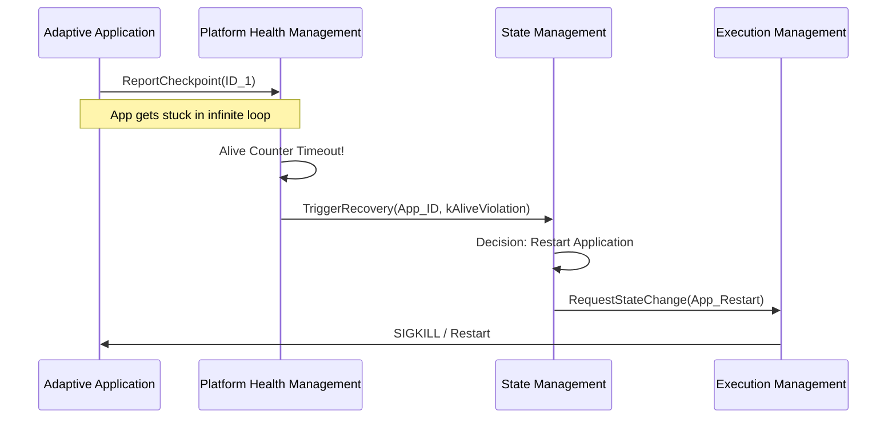

The **Platform Health Management (PHM)** functional cluster acts as the "Watchdog" for the AUTOSAR Adaptive Platform. While **State Management (SM)** handles high-level logic, **PHM** performs the low-level monitoring of process execution and hardware integrity.

---

### 1. Architectural Role

PHM is responsible for supervising applications and the platform itself. It detects functional failures (like a process getting stuck in a loop) and reports these "Health Results" to **State Management** so the system can recover (e.g., by restarting a process or entering a "Limp Home" mode).

---

### 2. Primary Supervision Mechanisms

PHM monitors software health through three distinct technical methods:

#### A. Alive Supervision (Heartbeat)

Checks if a process is "alive" by requiring it to report a "Checkpoint" at regular intervals.

* **Failure Case:** If an app is supposed to check in every 100ms but misses its window, PHM marks it as failed.

#### B. Deadline Supervision (Timing)

Checks the time elapsed between two specific points in the code.

* **Failure Case:** If a "Start Calculation" and "End Calculation" checkpoint take 50ms when the limit is 10ms, a timing violation is triggered.

#### C. Logical Supervision (Control Flow)

Ensures that the code is executing in the correct order.

* **Failure Case:** If an app jumps from "Initialize" directly to "Send Data" without passing through "Authenticate," PHM detects an illegal transition in the execution graph.

---

### 3. "Health Channel" & Recovery

PHM doesn't just watch apps; it also monitors hardware via **Health Channels**.

* **Health Channel:** An abstraction for external status like "Voltage Level," "CPU Temperature," or "RAM Parity."
* **Arbitration:** PHM aggregates multiple supervision results into a **Health Summary**. If the summary indicates a critical failure, PHM triggers a "Recovery Notification" to **State Management**.

---

### 4. External Interfaces & C++ Usage

The application interface is located in **`ara::phm`**.

* **`ara::phm::PHM` Class:** The main object used to report checkpoints.
* **`ReportCheckpoint(CheckpointId)`:** The primary function called by developers within their main loops or critical sections.
* **Asynchronous Reporting:** Reporting a checkpoint is non-blocking to ensure PHM doesn't introduce latency into the application it is monitoring.

---

### 5. Interaction Flow: Detection to Recovery

---

### 6. Summary Table: PHM vs. EM vs. SM

These three clusters are often confused. Here is the distinction:

| Cluster | Key Question | Action |
| --- | --- | --- |
| **Execution Management (EM)** | "Is the process running?" | Starts/Stops the binary. |
| **Platform Health (PHM)** | "Is the process behaving correctly?" | Monitors timing and logic. |
| **State Management (SM)** | "What should we do about it?" | Decides the recovery strategy. |

---

### 7. PHM Error Codes (`PhmErrorDomain`)

* **`kCheckpointInvalid`:** The application reported an ID that wasn't defined in the manifest.
* **`kServiceInaccessible`:** The PHM daemon is not responding (a meta-failure).
* **`kConditionNotMet`:** A health channel reported a value outside of the permitted safety range.
