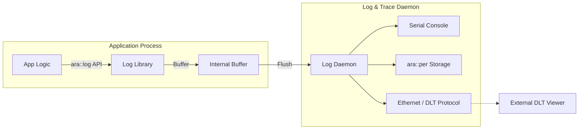

The **Log and Trace (`ara::log`)** functional cluster provides a high-performance, standardized logging framework. In the Adaptive Platform, logging is not just for debugging; it is a vital part of the system's observability and is designed to be safe for use in real-time, safety-critical environments.

### 1. Architectural Role

`ara::log` abstracts the logging destination. An application simply sends data to the "Log and Trace Daemon," which then decides where to route it (e.g., to a serial console, a file on the disk via `ara::per`, or over the network using the **LT protocol** via Ethernet).

The framework is optimized for **low latency**. It uses a non-blocking internal buffer to ensure that writing a log message doesn't stall a high-priority ADAS control loop.

---

### 2. Functional Components

#### A. Log Levels

`ara::log` defines six standardized severity levels. This allows developers and system integrators to filter noise:

* **`kFatal`**: System-level failure (cannot continue).
* **`kError`**: Operational failure.
* **`kWarn`**: Potential issues (recoverable).
* **`kInfo`**: General operational tracking.
* **`kDebug`**: Detailed internal state (usually disabled in production).
* **`kVerbose`**: Raw data/trace (highest volume).

#### B. Log Contexts

Applications can define multiple **Contexts** (e.g., "COMM", "CALC", "UI").

* Each context has its own ID and description.
* Log levels can be configured per context independently.
* **Implementation Benefit:** You can turn on `Verbose` for the networking module while keeping the rest of the app at `Info`.

---

### 3. Implementation Options & Protocols

The specification focuses on the **LT Protocol** (Log and Trace), which is essentially the AUTOSAR version of the industry-standard **DLT (Diagnostic Log and Trace)** protocol.

* **Network Binding:** Logs are typically encapsulated in Ethernet frames (often via UDP).
* **Message Format:** Each log entry includes a 32-bit timestamp (synchronized via `ara::ts`), a Message ID, a Context ID, and the payload.
* **Dynamic Configuration:** The platform supports "Remote Configuration." A technician can send a command to the vehicle to change the log level of a specific process without reflashing the software.

---

### 4. C++ Usage & API

The API is designed with a **Fluent Interface** (using `operator<<`) and avoids temporary string allocations to prevent heap fragmentation.

#### Basic implementation:

```cpp
#include "ara/log/logging.h"

// 1. Create a Logger for a specific context
auto& myLogger = ara::log::CreateLogger("PROC", "Main Image Processing");

void ProcessFrame() {
    // 2. Log with fluent syntax
    myLogger.LogInfo() << "Processing frame number:" << frameCount;

    if (temperature > 90) {
        myLogger.LogWarn() << "High temperature detected:" << temperature;
    }
}

```

#### Key Functional Features:

* **Hex/Bin Representation:** Specific helpers for raw data: `ara::log::HexFormat(data)`.
* **Non-Blocking:** Messages are offloaded to a background thread to prevent "log-stalls."
* **Log Forwarding:** The daemon can "fan out" logs—sending them to a local logger for black-box storage and a remote network tool simultaneously.

---

### 5. Interaction & Dependencies

| Interface Partner | Direction | Purpose |
| --- | --- | --- |
| **Time Sync (`ara::ts`)** | `ara::ts` $\rightarrow$ `ara::log` | Provides the synchronized global timestamp for every log entry. |
| **Persistency (`ara::per`)** | `ara::log` $\rightarrow$ `ara::per` | Used when logs need to be stored locally for "Black Box" crash analysis. |
| **Communication Mgmt** | `ara::log` $\rightarrow$ `ara::com` | Uses network bindings to ship logs off-machine to a diagnostic tool. |

---

### 6. Log and Trace Flow (Mermaid)



---

### 7. Important Design Constraint

> **Avoidance of Exceptions:** In line with the `ara::core` philosophy, the logging cluster does not throw exceptions. If the log buffer is full, the default behavior is typically to drop the oldest message to ensure the application's real-time performance is never compromised.