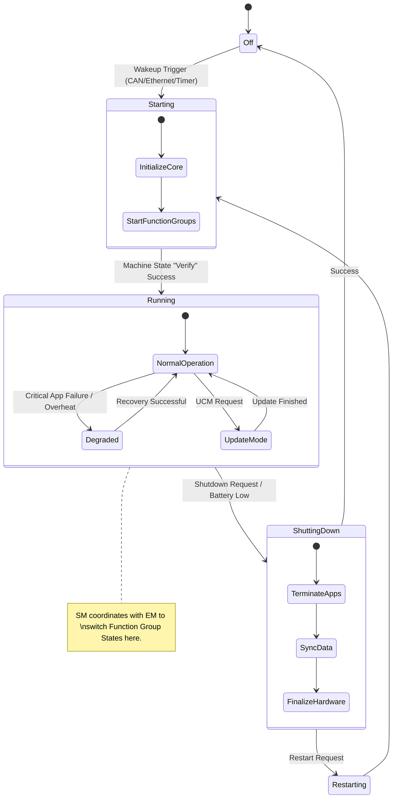

The **AUTOSAR Adaptive State Management (SM)** functional cluster is the operational "brain" of the Machine. While **Execution Management (EM)** provides the mechanisms to start/stop processes, **State Management** contains the actual control logic—deciding *when* the system should transition between different operational modes.

---

### 1. Architectural Role

State Management is responsible for the overall operational state of an Adaptive Machine. It acts as a policy engine that processes inputs (like vehicle signals or internal errors) and requests state changes from other functional clusters.

It bridges the gap between high-level vehicle events (e.g., "Driver opened door," "Battery low") and low-level platform actions (e.g., "Start Infotainment group," "Shut down 5G modem").

### 2. Primary Functions

The R24-11 specification defines several key responsibilities that SM must handle:

* **Function Group State Control:** SM interacts with Execution Management to switch "Function Groups" (bundles of processes). For example, it can request the "Telematics" group to move from `Off` to `Running`.
* **Machine State Management:** It manages global machine states such as `Startup`, `Shutdown`, `Restart`, and `Wakeup`.
* **Resource Group Control:** SM can manage CPU or memory resources associated with specific states to ensure safety-critical processes have priority.
* **Partial Networking:** It coordinates with `ara::com` and the Network Management (NM) cluster to enable or disable specific communication channels (VLANs/PNs) based on the current mode to save power.
* **Error Handling & Recovery:** If a critical process fails, EM reports this to SM. SM then decides the recovery strategy—such as restarting the process, transitioning to a "Degraded" mode, or forcing a Machine reset.

---

### 3. External Interfaces & Dependencies

State Management is highly "interconnected," acting primarily as a client to other platform services.

#### A. Upward Interface (Application Interaction)

* **`ara::sm` (The State Management API):** Allows "State Client" applications to request mode changes (if they have the correct permissions) or subscribe to state change notifications.
* **Trigger and Notifier:** SM uses a "Trigger" mechanism to initiate a change and a "Notifier" to broadcast once the change is successful.

#### B. Downward Interface (Platform Interaction)

SM depends on almost every other Functional Cluster to execute its decisions:

| Interface Partner | Direction | Purpose |
| --- | --- | --- |
| **Execution Management** | SM $\rightarrow$ EM | Requests changes to Function Group states (starting/stopping binaries). |
| **Communication Management** | SM $\rightarrow$ COM | Enables/disables service discovery or specific network bindings for power saving. |
| **Update & Config Management** | SM $\rightarrow$ UCM | Coordinates "Update Mode" where normal apps are stopped to allow software flashing. |
| **Diagnostic Management** | DM $\rightarrow$ SM | Reports diagnostic events (DTCs) that might require SM to enter a "Limp Home" state. |
| **Network Management** | NM $\rightarrow$ SM | Provides network sleep/wakeup triggers. |

#### C. C++ Usage & Error Handling

Consistent with `ara::core` (as discussed previously), the SM interface:

* Uses **`ara::core::Result`** and **`ara::core::Future`** for all state change requests, as switching states is an asynchronous operation that can take significant time.
* Defines specific **Error Codes** for failures like `kRejected` (transition not allowed in current state) or `kTimeout` (processes failed to stop in time).