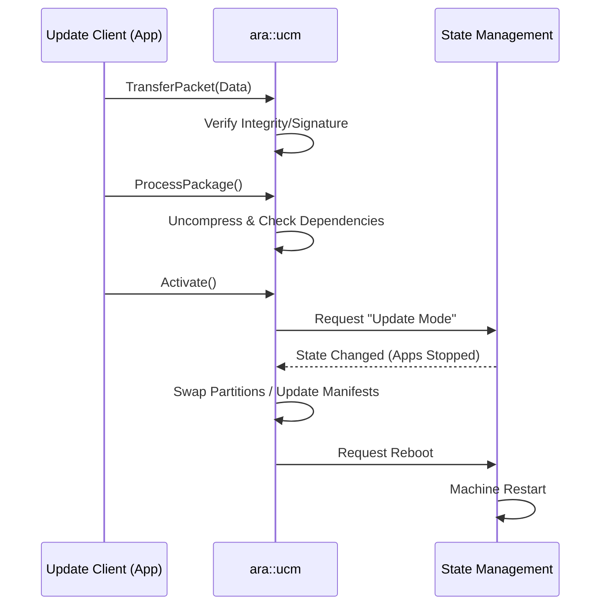

The **Update and Configuration Management (UCM)** functional cluster is the Adaptive Platform's equivalent to an "App Store Manager" or an "OTA (Over-the-Air) Update Agent." Its primary role is to manage the installation, uninstallation, and updating of software clusters on the Machine.

---

### 1. Architectural Role

UCM provides a standardized interface for updating the platform and applications. It abstracts the complexity of file transfers, package verification, and filesystem coordination.

The fundamental unit of update in UCM is the **Software Cluster**. A Software Cluster is a collection of executables, configuration files, and manifests that are treated as a single atomic unit.

---

### 2. Primary Functions

UCM acts as a state machine that moves through a specific lifecycle for every update:

* **Package Management:** Receiving "Software Packages," verifying their integrity (checksums), and authenticating their origin (digital signatures).
* **Dependency Checking:** Ensuring that a new Software Cluster is compatible with the current version of the Adaptive Platform and other installed clusters.
* **Orchestration of Update Campaigns:**
1. **Transfer:** Moving the package from the client to the UCM's internal buffer.
2. **Process:** Unpacking and preparing the files.
3. **Activate:** Switching the system to use the new version.
4. **Finish/Rollback:** Committing the changes or reverting if the new version fails to boot or perform correctly.

* **A/B Partitioning Coordination:** Managing "redundant" partitions. UCM often writes the new software to an inactive partition, then instructs State Management to reboot into that partition.

---

### 3. External Interfaces & C++ API

The UCM logic is accessed through the **`ara::ucm`** namespace. Like other clusters, it follows the `ara::core` patterns for safety and determinism.

#### A. Key `ara::ucm` Classes & Functions

* **`PackageManagement` Interface:** The main entry point for an "Update Client" application. It provides methods like `TransferData()`, `ProcessPackage()`, and `Activate()`.
* **`GetHistory()`:** Allows the system to query which updates were applied, when, and whether they were successful.
* **`GetSwClusterInfo()`:** Returns a list of all currently installed software versions on the Machine.

#### B. Error Codes (`UcmErrorDomain`)

UCM defines specific errors to handle the complexities of flashing software:

* **`kPackageInconsistent`:** Signature or checksum verification failed.
* **`kDependencyCheckFailed`:** The new software requires a library version not present on the Machine.
* **`kInsufficientStorage`:** Not enough space in the internal buffer for the package.
* **`kOperationNotAllowed`:** Attempting to update while the vehicle is in a state (e.g., "Driving") where State Management has prohibited updates.

---

### 4. Dependencies & Interaction Flow

UCM is a "heavy" cluster that coordinates with almost every other safety-relevant part of the platform.

| Partner | Interaction Role |
| --- | --- |
| **State Management (SM)** | **Critical Dependency.** UCM must ask SM to enter "Update Mode" to stop non-essential apps before flashing. SM also triggers the final reboot to the new partition. |
| **Execution Management (EM)** | UCM provides EM with the new manifests. EM uses these to know how to start the newly updated processes after the next reboot. |
| **Identity & Access Mgmt (IAM)** | Verifies if the Update Client has the "rights" to initiate an update or access specific clusters. |
| **Crypto Stack (`ara::crypto`)** | Used by UCM to perform the heavy lifting of signature verification and decryption of packages. |

---

### 5. Update Lifecycle (Mermaid Flow)

UCM often works hand-in-hand with Diagnostics.