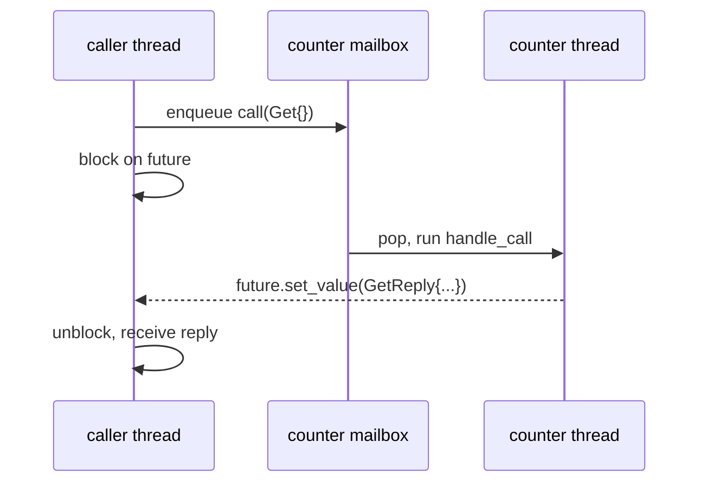
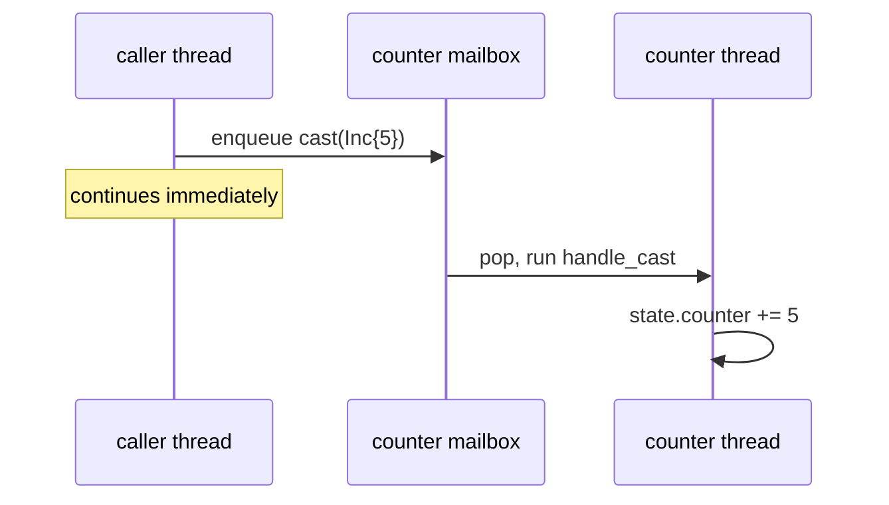
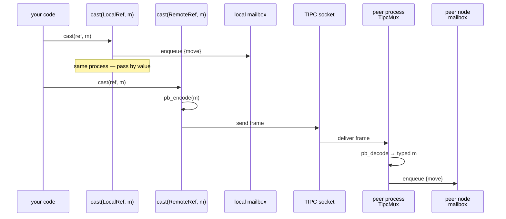
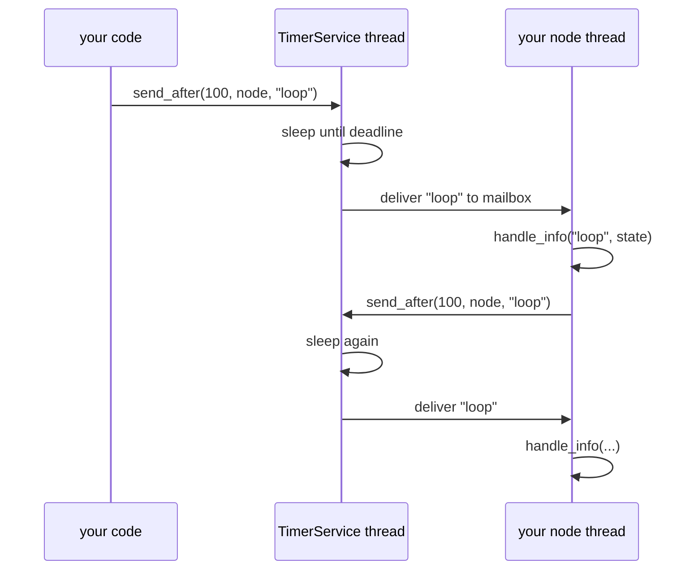
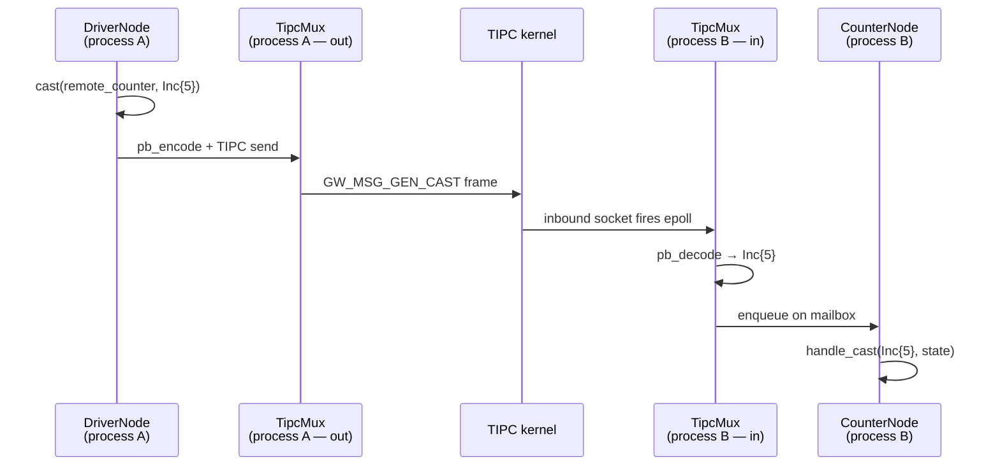
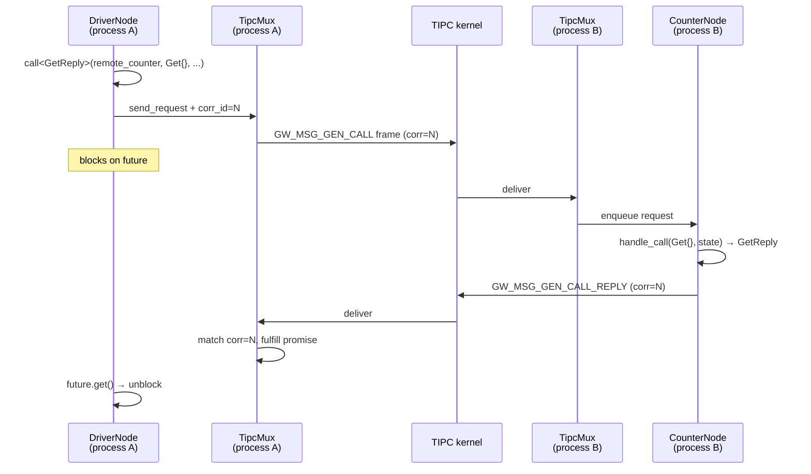

# platform/runtime — the actor runtime

This document describes the C++ runtime that lives under
`platform/runtime/`. It's the layer your applications run on top of:
nodes, mailboxes, typed messaging between them, timers, and tracing.

If you're writing an app, the **User Guide** is what you want. The
**Implementation Notes** at the end are for people changing the
runtime itself.

> Footnote (only if you know it already): the design is a faithful
> C++ port of Erlang/OTP's `gen_server` pattern. You can skip the
> Erlang vocabulary entirely — this doc explains everything from
> scratch using C++ terms.

---

# Part 1 · User Guide

## 1. The mental model in one screen

A **node** is an object with:
- Its own thread.
- Its own state (a struct you define).
- A **mailbox** — a FIFO of typed messages.

The thread loops: pop a message, run the matching handler, repeat. No
one else touches your node's state — only the node's own thread does,
serially, one message at a time. **No locks inside handlers.**

You write three kinds of handlers and one optional teardown:

| Handler | When it runs | What it returns |
|---|---|---|
| `handle_call(req, state) → Reply` | A caller asked you a question (sync request/reply) | The reply, by value |
| `handle_cast(msg, state) → void` | Someone notified you of an event (one-way, no reply) | Nothing |
| `handle_info(reason, state) → void` | A timer fired, or some opaque internal event | Nothing |
| `terminate(reason, state) → void` (optional) | The runtime is stopping you | Nothing |

You send three kinds of messages to other nodes:

| Verb | Caller blocks? | Reply? | Routes to |
|---|---|---|---|
| `call(node, req, ...)` | Yes, until reply or timeout | Yes | `handle_call` |
| `cast(node, msg)` | No | No | `handle_cast` |
| `send_request(node, req, act)` | No (returns a future) | Yes | `handle_call` |

The runtime owns the threads, the mailboxes, the message routing. You
own the **state** and the **handler bodies**.

---

## 2. Hello, node

Smallest possible node — a counter:

```cpp
#include "GenServer.hh"

struct CounterState { int32_t counter = 0; };
struct Inc      { int32_t n; };
struct Get      {};
struct GetReply { int32_t value; };

class CounterNode
    : public demo::runtime::GenServer<CounterNode, CounterState> {
 public:
    static constexpr const char* kNodeName = "CounterNode";

    // sync: someone called Get() and wants the value back
    GetReply handle_call(const Get&, CounterState& s) {
        return GetReply{s.counter};
    }

    // async: someone sent Inc{n} and doesn't expect a reply
    void handle_cast(const Inc& msg, CounterState& s) {
        s.counter += msg.n;
    }

    // catch-all: timer fired, supervisor poked us, etc.
    void handle_info(const char* reason, CounterState&) {
        // ignore or log
    }
};
```

That's the whole node. To use it:

```cpp
CounterNode counter;
counter.start();               // spawns the thread

// in some other code, possibly another thread:
demo::runtime::cast(counter, Inc{5});
demo::runtime::cast(counter, Inc{3});

auto r = demo::runtime::call<GetReply>(
    counter, Get{}, /*act=*/0, /*timeout_ms=*/500);
assert(r.tag == demo::runtime::CallTag::Reply);
assert(r.reply.value == 8);

counter.stop("normal");        // drains mailbox, then joins
```

The first three lines run on whatever thread called them. The
`handle_cast` / `handle_call` calls run on counter's own thread,
serially in mailbox order.

---

## 3. The three callbacks in detail

### 3.1 `handle_call` — synchronous request/reply

The caller blocks until your handler returns. The handler must return
a reply value (or throw — exceptions surface as `CallTag::Error` on
the caller side).

```cpp
GetReply CounterNode::handle_call(const Get&, CounterState& s) {
    return GetReply{s.counter};
}
```

Sequence:



If your handler runs for a long time, the caller stays blocked. If
multiple messages are queued, they wait their turn — the counter's
thread is single-threaded by design.

### 3.2 `handle_cast` — async fire-and-forget

The caller doesn't wait. The message is enqueued; the caller continues
immediately. Your handler runs whenever the node's thread gets to it.

```cpp
void CounterNode::handle_cast(const Inc& msg, CounterState& s) {
    s.counter += msg.n;
}
```



Cast never returns a value. If you care about the result, use
`call` or `send_request`.

### 3.3 `handle_info` — catch-all

For messages that aren't typed structs — timer wake-ups, supervisor
notifications, anything internal. The payload is a `const char*`.

```cpp
void CounterNode::handle_info(const char* reason, CounterState& s) {
    if (std::strcmp(reason, "tick") == 0) {
        // periodic work
    }
}
```

You typically pair this with the timer API (see §6).

### 3.4 `terminate` — optional teardown

Runs on the node's own thread, **after** the mailbox drains, **before**
the thread exits. Use it to close handles, flush logs, notify peers.

```cpp
void CounterNode::terminate(const char* reason, CounterState& s) noexcept {
    logger_->info("counter stopping with reason: " + std::string(reason));
}
```

Triggered by `node.stop("reason")` from any thread. The caller of
`stop()` blocks until `terminate` finishes — so you can rely on
post-terminate state being final.

---

## 4. The three send verbs

### 4.1 `cast` — send a typed message, don't wait

```cpp
demo::runtime::cast(counter, Inc{5});
```

Returns immediately. The receiver runs `handle_cast(const Inc&, state)`.

### 4.2 `call` — send, block until reply, return the reply

```cpp
auto result = demo::runtime::call<GetReply>(
    counter, Get{}, /*act=*/0, /*timeout_ms=*/500);

switch (result.tag) {
  case CallTag::Reply:   use(result.reply); break;
  case CallTag::Timeout: handle_no_reply(); break;
  case CallTag::Error:   log(result.error); break;
}
```

The `act` is a piece of data **you** define and pass; it comes back
in `result.act` for correlation. Use 0 if you don't care.

**Trade-off:** while blocked, your thread does nothing else. If your
caller is itself a node (very common), its mailbox queues up while
you wait.

### 4.3 `send_request` — send, get a handle, collect later

For when you want to fire off N requests in parallel and collect them
as they come back:

```cpp
auto rid1 = demo::runtime::send_request<GetReply>(counter, Get{}, MyAct{1});
auto rid2 = demo::runtime::send_request<GetReply>(other,   Get{}, MyAct{2});

// do other work...

auto r1 = demo::runtime::receive_response(std::move(rid1), 500);
auto r2 = demo::runtime::receive_response(std::move(rid2), 500);
```

Or use a **RequestIdCollection** to wait on whichever finishes first:

```cpp
demo::runtime::RequestIdCollection<GetReply, MyAct> col;
col.send_request(counter, Get{}, MyAct{1});
col.send_request(other,   Get{}, MyAct{2});

while (!col.empty()) {
    auto r = col.wait_one(/*timeout_ms=*/500);
    // r.act tells you which one came back
}
```

The collection wakes immediately when any of its requests finish (no
polling — see §10 for why this matters).

### 4.4 At a glance

| You write... | Caller behavior | Receiver callback | Useful when |
|---|---|---|---|
| `cast(node, msg)` | Returns immediately | `handle_cast` | One-way notification (event, command) |
| `call<Reply>(node, req, act, t)` | Blocks until reply or timeout | `handle_call` | You need the answer now |
| `send_request<Reply>(node, req, act)` | Returns a handle immediately | `handle_call` | Multiple in-flight, collect later |

`call` is `send_request` + `receive_response` under the hood — same
server-side path, different caller-side waiting strategy.

---

## 5. References: local and remote

You'd like to pass a reference to one node into another, and have the
called node use the same `cast` / `call` API regardless of whether the
target is in the same process or somewhere else.

We do that with two ref types:

| Ref type | Backing | API |
|---|---|---|
| `LocalRef<NodeType>` | A direct pointer to the node in this process | `cast(ref, msg)` enqueues into the mailbox |
| `RemoteRef<NodeType, tipc_type, tipc_inst>` | A TIPC socket to a peer process | `cast(ref, msg)` serializes and sends |

**The user code is the same:**

```cpp
template <typename CounterRef>
class DriverNode : public GenServer<DriverNode<CounterRef>, DriverState> {
    CounterRef& counter_;
public:
    void some_handler(DriverState& s) {
        // Works whether counter_ is LocalRef or RemoteRef
        demo::runtime::cast(counter_, Inc{5});
        auto r = demo::runtime::call<GetReply>(
            counter_, Get{}, MyAct{}, 500);
    }
};
```

The composition (which node lives where) decides the ref types when
instantiating `DriverNode<LocalRef<CounterNode>>` vs
`DriverNode<RemoteRef<CounterNode, 0xd0010001u, 0u>>`.



The local path passes the message by value (no serialization). The
remote path encodes via nanopb on send and decodes on receive. Same
user-visible API.

For setup, the composition main is responsible for:

```cpp
// Process P1, hosting counter locally:
demo::runtime::LocalRef<CounterNode> counter_ref(counter);
DriverNode<decltype(counter_ref)> driver(...);

// Process P2, where counter is remote:
demo::runtime::RemoteRef<CounterNode, 0xd0010001u, 0u> counter_ref;
counter_ref.connect(3000);  // 3-second eager connect with retry
DriverNode<decltype(counter_ref)> driver(...);
```

For remote use, you also need a **TipcMux** to receive replies and to
serve any local nodes' inbound traffic. See `demo/src/p1_main.cc`,
`p2_main.cc`, `p3_main.cc` for full examples.

---

## 6. Timers — `send_after` and `cancel_timer`

A timer is a message you schedule for **later** delivery to a node's
`handle_info`.

```cpp
demo::runtime::TimerService timers;   // spawn the timer thread once

// Send "tick" to counter in 100ms:
auto ref = demo::runtime::send_after(timers, 100, counter, "tick");

// Later, optionally:
int remaining = demo::runtime::cancel_timer(timers, std::move(ref));
// remaining > 0 → cancelled, that many ms left
// remaining == -1 → already fired (message already delivered)
```

The receiver's `handle_info` runs when the timer fires:

```cpp
void CounterNode::handle_info(const char* reason, CounterState& s) {
    if (std::strcmp(reason, "tick") == 0) {
        // do periodic work
    }
}
```

### Periodic timers (the standard pattern)

The runtime doesn't have a separate "interval" API. Instead, the
**handler reschedules itself** at the end:

```cpp
void TickerNode::handle_info(const char* reason, TickerState& s) {
    if (std::strcmp(reason, "loop") != 0) return;
    do_periodic_work(s);
    demo::runtime::send_after(timers_, 100, *this, "loop");  // reschedule
}
```



This pattern gives you exact control: you choose to skip a tick under
backpressure (just don't reschedule), or to slow down (reschedule with
longer delay), or to stop (don't reschedule).

### Cancellation

`cancel_timer` is **strict**: when it returns, the timer either:
- hasn't fired yet (and won't — `remaining > 0`), or
- has already fired (`remaining == -1`, the message is in the mailbox
  or already handled).

If cancel races with the fire, cancel_timer blocks briefly until the
fire either delivers or is suppressed. Caller never has to guard
against a stale wake-up from a cancelled timer.

---

## 7. Acknowledgement Tokens (ACTs) — pairing replies with requests

When you make multiple async requests, you need to tell their replies
apart. The runtime gives you an opaque field — the **ACT** — that
travels with the request and comes back in the reply.

```cpp
struct MyAct {
    enum class Kind { LoadConfig, GetStatus };
    Kind     kind;
    uint32_t request_id;
};

auto rid1 = send_request<ConfigReply>(
    server, ReadConfigReq{},
    MyAct{MyAct::Kind::LoadConfig, /*request_id=*/42});

auto rid2 = send_request<StatusReply>(
    server, GetStatusReq{},
    MyAct{MyAct::Kind::GetStatus, /*request_id=*/43});

// later... we don't care which order; act tells us:
auto r1 = receive_response(std::move(rid1), 1000);
if (r1.tag == CallTag::Reply) {
    switch (r1.act.kind) {
      case MyAct::Kind::LoadConfig: apply_config(r1.reply); break;
      // ...
    }
}
```

The runtime never inspects the ACT. You decide what to put in it; you
decide what to do with it when it comes back.

---

## 8. The caller-side reply handlers

`call_and_dispatch` is a convenience that ties `call` to a set of
caller-side callbacks. Instead of writing a switch on `result.tag`:

```cpp
class DriverNode : public GenServer<DriverNode, State> {
public:
    void handle_call_result(const GetReply& reply, const MyAct& act, State& s) {
        s.last_value = reply.value;
    }
    void handle_call_timeout(const MyAct& act, State& s) {
        s.timeouts++;
    }
    void handle_call_error(const std::string& reason, const MyAct& act, State& s) {
        s.errors.push_back(reason);
    }
};

// in some handler that runs on driver's own thread:
demo::runtime::call_and_dispatch<GetReply>(
    *this, counter, Get{}, MyAct{42}, /*timeout_ms=*/500);
```

The framework runs `call`, then dispatches to the matching handler on
**your own state**. You write the handlers; the framework wires.

| Outcome | Handler called |
|---|---|
| Reply arrived within timeout | `handle_call_result(reply, act, state)` |
| Server threw / framework error | `handle_call_error(reason, act, state)` |
| No reply within `timeout_ms` | `handle_call_timeout(act, state)` |

---

## 9. Tracing — observe what's happening at runtime

Every dispatch entry/exit emits a trace event. By default the trace is
**off** at runtime. You enable it from a supervisor (or a test) by
flipping an atomic flag on the tracer for a specific node type.

### Enabling

```cpp
demo::runtime::tracer_for("CounterNode").enable(true);
// ... messages flow, trace records appear on stderr ...
demo::runtime::tracer_for("CounterNode").enable(false);
```

### Format

Each event is one line on stderr (the sink is swappable later — see
implementation notes):

```
TRC v1 send         CounterNode msg=Inc       corr=1  ts=12ms hex=08 05
TRC v1 recv         CounterNode msg=Inc       corr=1  ts=12ms hex=08 05
TRC v1 dispatch     CounterNode msg=Inc       corr=1  ts=12ms hex=
TRC v1 dispatch_done CounterNode msg=Inc      corr=1  ts=12ms hex=
```

The fields:
- **event** — `send`, `recv`, `dispatch`, `dispatch_done`, `send_reply`,
  `info`, `terminate`, `call_result`, `call_timeout`, `call_error`,
  `call_wait`, `call_resume`.
- **node** — which node-type-name the tracer is for.
- **msg=** — the message type (its C++ struct name).
- **corr=** — correlation id. Pairs `send` with `recv` for RPCs.
- **ts=** — milliseconds since this Tracer's first event.
- **hex=** — raw nanopb wire bytes for messages that have a registered
  codec; empty otherwise.

### What gets traced

| Trace event | Emitted at |
|---|---|
| `send` | Right before a cast/send_request enqueues on the target |
| `recv` | Right before a node thread dequeues a message |
| `dispatch` | Right before a handle_* method runs |
| `dispatch_done` | Right after the handle_* method returns |
| `send_reply` | Right before a handle_call's reply is encoded & sent |
| `info` | Right before handle_info runs |
| `terminate` | Right before terminate() runs |
| `call_wait` / `call_resume` | Around the caller's block in sync call() |
| `call_result` / `call_timeout` / `call_error` | When a caller-side outcome dispatches |

### Why a runtime gate (not a compile-time `#ifdef TRACE`)

The motivating scenario: supervisor detects a node is crashing or
stuck. It flips the trace on for the **next** N crashes, captures the
record, then disables. With a compile-time gate, you'd have to ship a
debug build before you could observe anything — too late.

Producer cost when the gate is **off**: one relaxed atomic load + a
branch. ~1ns on modern x86. Negligible per dispatch.

---

## 10. Cross-process — when a node lives elsewhere

When your composition places one node in process A and another in
process B, the runtime gives you the **same API** with the same
semantics — only the implementation differs:



For `call`/`send_request` the round-trip adds a reply frame:



### Setting up a process

Each process needs:
1. A `TimerService` (so `send_after` works).
2. A `TipcMux` (the inbound multiplexer + outbound reply demuxer).
3. The local nodes themselves, bound on the mux.
4. RemoteRefs to any peer nodes, connected via the mux.

Skeleton:

```cpp
demo::runtime::TimerService timers;
demo::runtime::TipcMux mux;

CounterNode counter(CounterNodeInputs{logger});

// Bind counter on TIPC so remote peers can reach it:
auto* binding = mux.bind_node(counter, 0xd0010001u, /*instance=*/0u);
mux.register_cast<Inc>(binding, counter);
mux.register_call<Get, GetReply>(binding, counter);

// Connect to a remote peer:
demo::runtime::RemoteRef<PeerNode, 0xd0010002u, 0u> peer_ref;
peer_ref.connect(3000);
mux.watch_remote_ref(peer_ref);   // route replies back

mux.start();
counter.start();

// ... run ...

mux.stop();
counter.stop("normal");
```

For most apps, this scaffolding is **generated** by
`artheia gen-app-composition` — see §11.

---

## 11. Generated apps

When you describe a system in artheia DSL (`.art`), the generator
emits one CMake project per process, with main.cc that wires up the
timers, mux, nodes, and refs above. You only write the node bodies.

```art
node atomic CounterNode {
    tipc type=0xd0010001 instance=0
    ports {
        server   srv      provides CounterSrv
        receiver inc_in   requires IncIface
    }
}

node atomic DriverNode {
    tipc type=0xd0010002 instance=0
    kick_off                  ← framework auto-calls kick_off() at boot
    requires_timers           ← framework injects TimerService into Inputs
    ports {
        sender inc_out      provides IncIface
        client counter_call requires CounterSrv
    }
}

composition Demo3Way {
    prototype CounterNode counter_p1   on process P1
    prototype DriverNode  driver_p1    on process P1
    prototype ObserverNode observer_p2 on process P2

    connect driver_p1.counter_call    to counter_p1.srv
    connect observer_p2.counter_call  to counter_p1.srv
}
```

Run:

```sh
artheia gen-app-composition demo/system/package.art \
    --composition Demo3Way \
    --out applications/demo_composition
```

You get one project per process under `applications/demo_composition/`,
each with a generated `main.cc` doing the wiring. Your job is the
node implementation files.

The annotations the generator reads:

| .art annotation | Effect |
|---|---|
| `kick_off` | Generator calls `node.kick_off()` after `start()` |
| `requires_timers` | Generator adds `TimerService&` to the node's Inputs |
| `tipc type=0xN instance=M` | Generator uses these for `mux.bind_node(...)` and matching RemoteRefs |
| `on process P` (on a prototype) | Generator partitions; LocalRef vs RemoteRef chosen per process |
| `connect a.port to b.port` | Generator wires inputs and registers inbound dispatch |

---

# Part 2 · Implementation Notes

For people changing the runtime itself, not just using it.

## A. Mailbox + thread

`GenServerBase` (in `GenServer.hh`) owns:
- `std::deque<std::function<void(GenServerBase*)>> mailbox_`
- `std::mutex mu_` + `std::condition_variable cv_`
- `std::thread thread_`
- `std::atomic<bool> running_`

The thread runs:

```cpp
while (true) {
    MailboxFn fn;
    {
        std::unique_lock lk(mu_);
        cv_.wait(lk, []{ return !running_ || !mailbox_.empty(); });
        if (!running_ && mailbox_.empty()) break;
        fn = std::move(mailbox_.front());
        mailbox_.pop_front();
    }
    fn(this);   // dispatches into Derived via the captured lambda
}
dispatch_terminate_(reason);   // run Derived::terminate(...)
```

The mailbox is **type-erased**: every entry is a
`std::function<void(GenServerBase*)>`. The type information lives in
the lambda's captures.

When a caller does `cast(server, Msg{5})`, the free function builds a
lambda like:

```cpp
[m = std::move(msg)](GenServerBase* base) {
    auto* self = static_cast<Server*>(base);
    self->handle_cast(m, self->state());
}
```

`Server` is known at the call site, so the lambda performs the typed
downcast and overload-resolves to the right `handle_cast`. The
mailbox doesn't know or care about `Msg`.

## B. Why CRTP for `GenServer<Derived, State>`

The base class needs to call `Derived::handle_info(...)` and
`Derived::terminate(...)`, which are non-virtual. CRTP gives us the
Derived type at compile time:

```cpp
template <typename Derived, typename StateT>
class GenServer : public GenServerBase {
    void dispatch_info_(const char* info) override {
        static_cast<Derived*>(this)->handle_info(info, state_);
    }
    // ...
};
```

Side-effect: `Derived` provides `static constexpr const char* kNodeName`
which the framework uses for tracing.

## C. `call` composes from `send_request`

```cpp
template <typename Reply, typename Server, typename Req, typename Act>
CallResult<Reply, Act> call(Server& s, Req r, Act a, int t) {
    // ... CallWait trace ...
    auto result = receive_response(
        send_request<Reply>(s, std::move(r), std::move(a)),
        t);
    // ... CallResume trace ...
    return result;
}
```

This is the same identity Erlang documents for `gen_server:call`. By
composing, we get one server-side path (via `send_request`'s lambda)
and one caller-side wait path. The trace points sit on the right
abstractions automatically.

## D. RequestIdCollection: reactive wait

The old implementation polled `future.wait_for(0)` in a loop with a
2ms sleep — would burn cycles and add up to 2ms latency per wakeup.

The current implementation uses a shared `NotifyHook`:

```cpp
struct NotifyHook {
    std::mutex                mu;
    std::condition_variable   cv;
    std::atomic<size_t>       ready_count{0};
};
```

The collection owns a `shared_ptr<NotifyHook>`. When you call
`col.send_request(server, req, act)`, the underlying `send_request<>`
gets the hook as its 4th argument. The dispatch lambda, after
`promise.set_value(...)`, increments `hook->ready_count` and notifies
`hook->cv`.

`wait_one` blocks on `cv.wait_until(deadline, predicate)`. No polling.

For backward compatibility, `add(RequestId&&)` is still supported. A
RequestId added through `add` doesn't get a hook (its promise was
sealed before `add` ran), so the collection counts these as
"legacy polled" and runs a short poll-loop alongside the cv wait when
any are present. Mixing both works.

## E. Tracer

`tracer_for(name)` returns a process-wide `Tracer&` keyed by node
name. Singletons leak by design (one per name; outlive everything).

`enabled()` is the hot path — single `std::atomic<bool>` relaxed load.
When false, the trace point returns immediately. When true:
1. Stack-allocate a ~1KB buffer.
2. `snprintf` the header (`TRC v1 ev node msg=T corr=N ts=Xms hex=`).
3. Hex-encode the payload bytes inline.
4. Single `fputs(buf, stderr)` — glibc serializes per-FILE.

Payload format is intentionally hex-on-a-line for now. A future
collector binary decodes the wire bytes via `pb_decode` against the
registered nanopb descriptors (see `config/message_filter.csv` +
`libtrace_decoder.so` — out of scope here).

## F. Cross-process dispatch (TipcMux)

`TipcMux` runs one shared epoll thread per process that watches:
- N **listening** TIPC sockets, one per local node (bound at the
  node's `tipc type/instance` from `.art`).
- M **outbound client** fds, one per remote RemoteRef this process
  opened.

On a frame arrival:
- Inbound listening socket → `accept()` new client, add to epoll.
- Accepted client fd → `recv()` a frame, look up the destination node
  by fd, decode via the registered codec, enqueue on the node's
  mailbox.
- Outbound client fd → `recv()` a CALL_REPLY frame, look up the
  RemoteRef by fd, fulfill the matching promise by correlation_id.

The `register_call<>` lambda runs the whole call+reply on the
**node's** thread (not the mux thread) so the mux thread stays
unblocked — this matters when many concurrent calls arrive (see
`tipc_concurrent_calls` test).

## G. Type erasure for codecs

Cross-process messages need a nanopb codec. Each codec is a
`RemoteCodec<T>` specialization with:
- `service_id` — a stable 16-bit hash of the type name.
- `fields()` — returns the nanopb descriptor.

Specialized via a macro:

```cpp
DEMO_DECLARE_REMOTE_CODEC(demo_system_Inc);
```

The trace path also uses these codecs (`encode_for_trace<T>`). For
types without a codec, SFINAE picks a no-op overload — the trace
record carries the event + type tag but no payload bytes. Doesn't
break the build for in-process-only types.

## H. Thread topology per process

| Thread | Purpose |
|---|---|
| Main | Owns `TimerService`, `TipcMux`, the node objects |
| Per-node thread × N | Runs that node's mailbox loop |
| TimerService thread | One min-heap of pending timers, sleeps until next deadline |
| TipcMux epoll thread | epolls all bound sockets + outbound client fds |

For a process with 3 local nodes: 1 (main) + 3 (node threads) + 1
(timer) + 1 (TipcMux) = 6 threads. None of them do work that's
proportional to message rate — message dispatch happens on the
already-existing node threads.

---

# Part 3 · Cross-references

- `demo/` — reference / scratch project that uses every part of this
  runtime. Read `demo/src/p1_main.cc`/`p2_main.cc`/`p3_main.cc` for
  hand-wired multi-process examples; `applications/demo_composition/`
  for generated equivalents.
- `platform/runtime/test/` — the canonical test suite. Reading
  individual cases is the fastest way to learn an API surface.
- `docs/application.md` — older app-shim doc (LifecycleInterface,
  rx_loop, the AUTOSAR-driven path). Different generator, different
  use case; the runtime described here is the newer actor stack.

# Appendix · Erlang/OTP heritage

If you've used Erlang's `gen_server`, this runtime is a near-direct
C++ port:

| Erlang | C++ here |
|---|---|
| `gen_server:call(srv, msg)` | `call<Reply>(srv, msg, act, timeout_ms)` |
| `gen_server:cast(srv, msg)` | `cast(srv, msg)` |
| `gen_server:send_request(srv, msg)` | `send_request<Reply>(srv, msg, act)` |
| `gen_server:receive_response(req_id, t)` | `receive_response(rid, t)` |
| `gen_server:reqids_*` collection | `RequestIdCollection<Reply, Act>` |
| `Module:handle_call(req, from, state)` | `handle_call(const Req&, State&) → Reply` |
| `Module:handle_cast(msg, state)` | `handle_cast(const Msg&, State&)` |
| `Module:handle_info(msg, state)` | `handle_info(const char* reason, State&)` |
| `Module:terminate(reason, state)` | `terminate(const char*, State&) noexcept` |
| `erlang:send_after(t, dest, msg)` | `send_after(timers, t, dest, "msg")` |
| `erlang:cancel_timer(ref)` | `cancel_timer(timers, ref)` |
| `sys:trace(srv, true)` (runtime trace) | `tracer_for("Name").enable(true)` |
| `Label` in `send_request/4` | `Act` template arg (echoed in `CallResult`) |

Differences:
- C++ doesn't have atoms, so `handle_info` takes `const char*` (you
  match by `strcmp`). For typed messages use `handle_cast`.
- `handle_call` returns the reply by value; we don't model the OTP
  `{noreply, NState}` deferred-reply shape (it would require keeping
  promises around, which we don't need).
- Tracing is runtime-toggleable but uses our own binary record format
  (no Erlang trace BIF compatibility).
