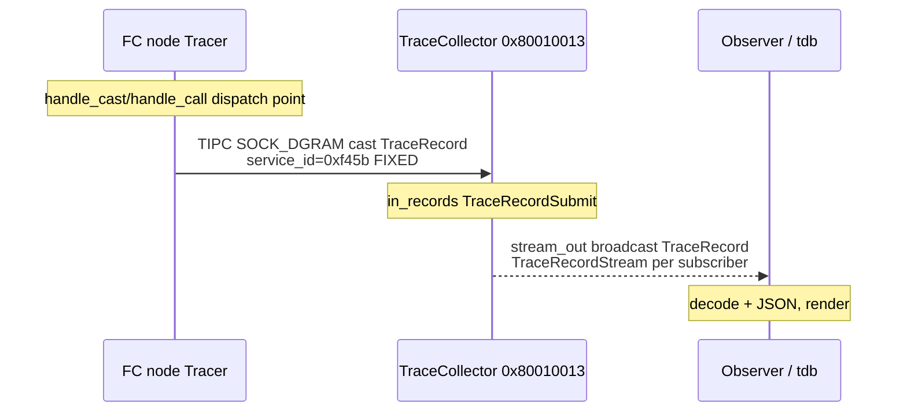
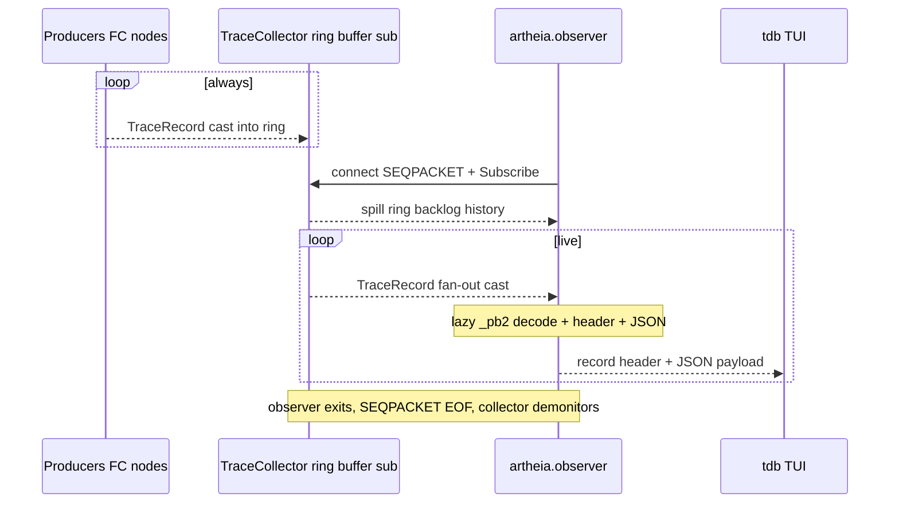
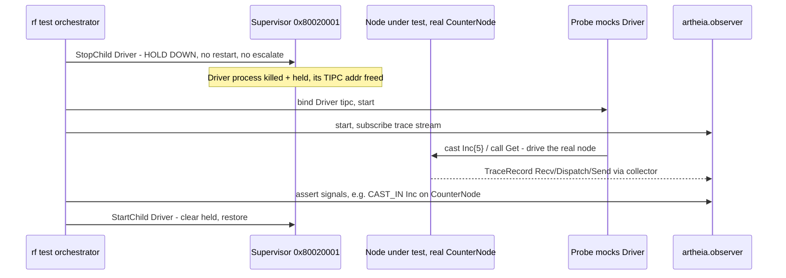

# Composition-isolation testing — probes + observer, all-TIPC

## Problem

We cannot split a composition into separately-tested nodes: the
interdependencies explode quadratically in test cases. Instead we **exercise
the whole composition end-to-end with probes** and **watch signals move inside
it with an observer**. A test stops the process(es) hosting the peer nodes,
binds a probe to each, drives the real node(s) under test, and asserts on the
trace stream the observer captures.

**Everything in this design is internal to Theia — Theia transport (TIPC)
only. No gRPC anywhere.** This supersedes the gRPC-bridge / ProbeDaemon /
SmProbe approaches (removed; see Cleanup below).

Three parts:
1. **Trace producer → log[trace]** — nodes emit execution traces to the
   TraceCollector (exists; one wire-id bug to fix).
2. **`artheia.observer`** — a Python Theia node that subscribes to the trace
   stream and yields a decoded record stream (OTP `dbg:tracer` shape). supdbg
   becomes a TUI front-end over it.
3. **Probes + supervisor stop-and-hold** — a set of probes exercises a
   composition in isolation; the supervisor stops the mocked nodes' processes
   **without firing the restart/escalation policy** so a probe owns the
   address.

## Design first at the ART level

Everything is declared in `.art` (the contract); the Python parts implement
that contract over the same wire a C++ node would. The observer and probes are
ART-declared Theia nodes **implemented outside the C++ runtime**, in Python,
reusing `artheia.gen_server` transport + lazy `.proto`→`_pb2` codec.

---

## Part 1 — Trace producer → log[trace]  (exists; one fix)

Current path (verified): a node's `Tracer` (platform/runtime/Tracer.hh), when
enabled + reporting, frames a `TraceRecord` and **casts it over TIPC
SOCK_DGRAM** to the TraceCollector at `0x80010013`. The collector
(`services/log`, node `TraceCollector`) receives on its `in_records`
(`TraceRecordSubmit`) port and re-broadcasts on `stream_out`
(`TraceRecordStream`) to every subscriber.

`TraceRecord` (services/log `.art`): `node_name`(src) · `dst` · `msg_type` ·
`corr_id` · `ts_ns` · `kind`(TraceKind: CAST_OUT/IN, CALL_OUT/IN, STATEM,
OTHER) · `payload`(the verbatim `[header][proto-wire]`).

**BUG TO FIX (regression from the `system_` proto rename):**
`Tracer.hh:138` hardcodes `kRecordServiceId = 0xb17a` = djb2 of the OLD type
name `services_services_log_TraceRecord`. The rename made the real nanopb type
`system_services_log_TraceRecord` → djb2 = **`0xf45b`**. So the producer's cast
service_id no longer matches the collector's `register_cast` → **traces do not
reach the collector today**. Fix: recompute `kRecordServiceId` from the current
name (or, better, derive it via `RemoteCodec<...>::service_id` so it can never
drift again).



---

## Part 2 — collector ring buffer + `artheia.observer` + `tdb` (logcat/adb model)

The trace path follows the **Android logcat / adb** model.

### Collector is always subscriber #0: a circular trace buffer

The collector ALWAYS has one consumer — itself. It keeps a **configurable
circular buffer** of recent `TraceRecord`s (logcat ring). Producers always have
a sink (the ring), so there's no "quiet the producers when nobody listens"
problem — the collector is always listening into its ring.

- Ring size is a `services/log` node param (etcd-backed, tunable per
  deployment, no rebuild):
  ```
  node atomic TraceCollector {
      params { trace_ring_records : uint32 = 4096 }
      ...
  }
  ```

### Subscribers: app-level fan-out, OTP-monitored

A subscriber (an observer) **connects to the collector service and Subscribes**.
The collector keeps a live subscriber registry and, on each record, **casts a
copy to every registered subscriber** (application-level fan-out — TIPC service
addressing is competing-consumer by default, so broadcast must be explicit
fan-out, not multiple binds on one `(type,instance)`).

- **adb-style attach**: on Subscribe the collector first **spills the ring**
  (the backlog) to the new subscriber, then **streams live** records. Same as
  `adb logcat` dumping history then following.
- **OTP-monitor by connection-close**: the subscriber holds a persistent
  `SOCK_SEQPACKET` connection. When it dies/exits, the collector's select loop
  sees EOF and **demonitors** that subscriber. No polling, no lease timers —
  TIPC signals the disconnect. When the last *external* subscriber leaves, the
  collector stops fanning out (but keeps filling its ring).

### `artheia.observer` (Python Theia node)

A new Python package **`artheia.observer`** (sibling of
`artheia.gen_server.probe`), reusing the same transport + codec machinery:

- **ART contract:** an `Observer`-shaped node (TIPC subscriber addr) that
  attaches to the collector's stream service. The `.art` is the contract; the
  Python observer implements it outside the runtime.
- **Reuses `artheia.gen_server`:** the TIPC transport + lazy `.proto`→`_pb2`
  codec (compile `system_services_log` on first use) to decode each
  `TraceRecord`.
- **OTP shape (`dbg:tracer`):** Subscribe once → spilled backlog, then a
  `handle_record(rec)` live stream. Each record → trace header
  (src/dst/msg_type/corr_id/ts_ns/kind) + **JSON serialization** of the decoded
  payload.
- **Output:** an iterable/queue of decoded records (header + JSON payload) a
  test or the TUI consumes.



### `tdb` — the Theia Debug Bridge (adb for Theia)

**`supdbg` is rewritten as `tdb`**, a TUI front-end wrapping
`artheia.observer` (no gRPC). adb-shaped subcommands:

| command | does |
| --- | --- |
| `tdb ps` | list nodes (from the supervisor tree) |
| `tdb attach <target>` | focus a target's traces (see cluster note below) |
| `tdb trace <node>` | `ConfigureTrace` the node on + follow its records |
| `tdb logcat` | spill the ring + follow live (the default firehose) |
| `tdb logcat -c` | clear/drain the ring |
| `tdb logcat -g` | get the ring size |
| `tdb supervisor` | supervisor tree / health |

> **Cluster note (BACKLOG):** `tdb attach <gateway>` — a *target* is a cluster
> on a TIPC **netid** (Host → netid 4711, RPI → netid 4712). We do NOT have
> cluster isolation by netid yet; `attach` to a remote cluster is a follow-up.
> Filed in the backlog: `docs/tasks/BACKLOG/cluster-netid-isolation.md`.

(rf integration of the observer is a later task.)

---

## Part 3 — Probes + supervisor stop-and-hold

A composition test stops the processes hosting the nodes to be mocked, binds a
probe to each, and drives the real node(s) under test. Suspension granularity
is **per-process** (the supervisor forks/execs one process per WorkerNode and
can only signal whole processes — it has no thread-level control). That's fine:
the test stops the process, the probe takes over its node's TIPC address.

**Supervisor change — stop WITHOUT restart/escalation.** Today
`TerminateChild` issues SIGTERM and the reap path normally re-applies the
restart strategy; a missing heartbeat (3s watchdog) SIGTERMs and **escalates**
(restart-budget → full system shutdown). For tests we need a **hold-down**:
stop the node's process and keep it down (no restart, no heartbeat-timeout
escalation) until explicitly resumed.

Add to `SupervisorControlIf` (the `.art` contract):
- `StopChild(name)` semantics extended (or a flag) → **hold down**: set a
  per-WorkerNode `held` flag so the reap path skips `on_child_exit()` and the
  watchdog skips the held pid (no SIGTERM-escalate).
- `StartChild(name)` clears `held` and restarts normally.

(Implementation note for later: `held` gates both `check_heartbeats()` and the
reap `on_child_exit()` path; per-process granularity, matching the model.)



### Control vs data messages

| flow | message | transport | direction |
| --- | --- | --- | --- |
| **control** | `StopChild`/`StartChild` (ControlRequest op_kind) | TIPC call → Supervisor `control` | rf → supervisor |
| **control** | `ConfigureTrace` (TraceControl) | TIPC call → TraceCollector `ctl_*` → relayed to nodes | rf/observer → collector → node |
| **data** | probe `Inc`/`Get` (the FC's own port messages) | TIPC cast/call → node-under-test | probe → SUT |
| **data** | `TraceRecord` | TIPC cast (SOCK_DGRAM) → collector; broadcast → observer | SUT → collector → observer |
| **telemetry** | `HeartbeatReport` | TIPC → Supervisor `reports` | node → supervisor |

---

## Cleanup (remove from docs + tasks — all-TIPC, no gRPC for this)

- Remove gRPC-trace-bridge mentions: `services/log/proto/trace_stream.proto`
  (the `:7710` gRPC egress), the `TraceStream` gRPC service, and references in
  `tools/supervisor-gui` + `docs/tasks/*` that route traces over gRPC.
- Remove **ProbeDaemon**: the block-commented node in
  `services/com/system/com/package.art` + the `*.bak` files
  (`ProbeDaemon*.{hh,cc}.bak`, `robot_node.*.bak`). Superseded by
  `artheia.gen_server.probe`.
- Remove **SmProbe / sm_prober / sm_stub** placeholder mentions from docs/tasks
  (superseded by `artheia.gen_server.probe`).
- Remove the deprecated stderr `TRC v1` trace consumers
  (`testing/rf_theia/runtime/trace_watcher.py`,
  `adapters/tracer_jsonl.py`) — the trace stream is the TIPC `TraceRecordStream`.
- `services/log/system/log/package.art` doc/comments: drop the gRPC-egress and
  com-bridge lines; the collector fans out over `stream_out` (TIPC) only.

## Resolved (iteration 2)

- **Fan-out is app-level**: collector keeps a subscriber registry and casts a
  copy of each record to every registered subscriber (not multiple binds on one
  `(type,instance)` — TIPC service addressing is competing-consumer).
- **Collector is always sub #0**: a configurable circular ring buffer
  (`trace_ring_records` param). adb-style: Subscribe spills the ring, then
  follows live.
- **Liveness = connection-close**: persistent SEQPACKET; EOF demonitors a dead
  subscriber (OTP monitor, no lease/poll).
- **Tool is `tdb`** (Theia Debug Bridge), rewritten over `artheia.observer`.

## Open design questions (resolve in the next iteration)

1. **Observer node address** — fixed TIPC type/instance for an observer, or a
   range so several `tdb`/observers attach at once (each a distinct instance)?
2. **`held` flag wire** — extend `StopChild` semantics vs a new `op_kind`; how
   `StartChild` distinguishes held-restore from cold-start.
3. **Trace enable for the SUT** — the test/`tdb` must `ConfigureTrace` the node
   under test on (CAST_IN/CALL_IN at least) so its signals land in the ring;
   confirm the rf→collector→node path still works after the service_id fix.
4. **Collector Subscribe op** — the collector needs a `Subscribe`/`Unsubscribe`
   surface (a new clientServer op on its control interface, or a dedicated
   stream-connect). Decide the exact `.art` for it (this replaces the in-process
   `subscribe_stream_out_rec` callback path, which a remote observer can't use).

---

> Status: IN IMPLEMENTATION.
> - Step 1 (trace service_id fix) DONE — commit a3bc5ad.
> - Step 2 (ring-buffer trace hub + remote Subscribe) DONE — commit 112ceb0;
>   TraceStreamPump (runnable) + TraceCtl (atomic) share a process-global
>   TraceHub; verified e2e by demo/test/trace_collector_fanout.py. The probe
>   bind-instance fix is artheia commit 278b52c.
> - Step 3 (artheia.observer) DONE — artheia commit 3484fb0, test 8b900eb.
>   TraceObserver.from_log_art(...).start()/records()/stop(); resolves TraceCtl
>   + Subscribe from the log .art; decodes via libprotobuf + JSON. Verified e2e
>   by demo/test/observer_stream.py.
> - Remaining: Step 4 supervisor SuspendChild/ResumeChild (op 12/13 + held
>   flag), Step 5 tdb TUI (over artheia.observer). Plus the Cleanup section
>   (gRPC bridge / ProbeDaemon / SmProbe / TRC-v1 removal).
